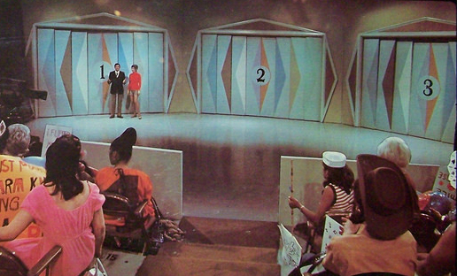
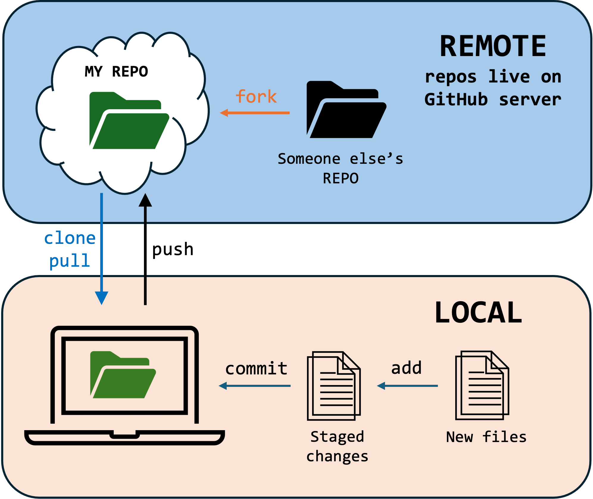

```{r setup, include=FALSE}
  options(htmltools.dir.version = FALSE)
  knitr::opts_chunk$set(
    message = F, 
    warning = F, 
    eval = T, 
    echo = F,
    fig.align = 'center', 
    dev = 'svglite'
  )
```


class: partial-bg50, middle

.pull-left[

```{r, out.width="75%"}
  
```

]

.pull-right[
# 01 - Introduction

- The Monty Hall problem

- Course, syllabus, etc

- Tech setup

  - Key packages

  - Linking to GitHub
]


---
class: segue-yellow

# Suppose you're on a game show...

```{r, out.width="50%"}
  
```

---
# The Monty Hall Problem


.pull-left[
### The problem
Suppose you're on a game show, and you're given the choice of three doors: Behind one door is a car; behind the others, goats. You pick a door, say No. 1, and the host, who knows what's behind the doors, opens another door, say No. 3, revealing a goat. He then says to you, "Do you want to pick door No. 2?" Is it to your advantage to switch your choice?

]

.pull-right[

### Marilyn weighs in

Marilyn vos Savant of *Parade* magazine famously responded by instructing the contestant to switch. Switching, she reasoned, doubles the probability of winning: $Pr[car|switch] = 2/3$; $Pr[car|stay] = 1/3$

]


---
# The Monty Hall Problem


.down[
### Your challenge

> Write and execute a computer simulation to evaluate Marilyn's claim. Present a table showing the number of simulated games won by the contestant who chose to switch and the number won by the contestant who stayed. Present the same information in a bar chart for good measure. Are your findings consistent with Marilyn's arguments? Is it better to switch?

]

---
# The Monty Hall Problem

.pull-left[
### Your turn

1. Open RStudio  

2. Create a new project in your week 1 folder 

3. Start a new R Script file

4. Start coding!
]

.pull-right[
### Starting a script

```{r, echo=TRUE, eval=FALSE}
#+ Monty Hall Simulation
#+ SIS 750
#+ 
#+ Austin Hart

## load packages
  library(tidyverse)
  library(knitr)

# Simulation -----------
## Set the stage
  ...
```
]

---
class: segue-yellow, middle, center


# Introductions!

<iframe src="https://giphy.com/embed/3ohhwKeYeRh1IEjNFC" width="350" height="350" frameBorder="0" class="giphy-embed" allowFullScreen></iframe>

---
# Get to know each other

- 

---
# Meet the course

### Take 5 minutes with the syllabus

- What's the expected weekly workload?  
- Where will you find course materials?  
- How does Hart evaluate participation and professionalism?   
- What constitutes individual work in this course?  


---
class: segue-yellow

# Tech setup

---
# Installing packages

.pull-left[
- `install.packages`: function that pulls and unpacks files from CRAN

- Packages contain a library of functions (and underlying code)

- Install once. Never again.

- To use functions from a package: 
  - `library(packname)` 
  - `require(packname)` (for writing functions)
  - `packname::function` (access on the fly)
]

.pull-right[
```{r, echo=TRUE, eval=FALSE}
## Our basic needs
  install.packages(c(
    'tidyverse', # dplyr, ggplot2, etc
    'knitr', # from markdown to whatev
    'modelsummary', # regression tables
    'gt', # all kinds of tables
    'felm', # FE reg models
    'patchwork', # composing graphs
    'xaringan', # composing slides
    'posterdown', # academic posters
    'tinytex', # beautiful pdf docs
    'usethis', 
    'gitcreds'
  ))

## Install tinytex  
  library(rmarkdown)
  tinytex::install_tinytex()
```
]

---
# Version control with `GitHub`

.pull-left[

> `GitHub` is a cloud-based `git` repository for code sharing and collaboration. 

- Host your R projects 

- Keep track of your work.

- Manage changes across teams

- Collect community feedback

- Host websites, slides, posters, docs, for free using `GitHub Pages`

]

.pull-right[

```{r, out.width="96%"}
  
```

]

---
# Conntecting to `GitHub`

.pull-left[
1. Install RStudio.

2. Create GitHub account: <https://github.com>.

3. Configure `git`

    - [install instructions](https://docs.github.com/en/get-started/getting-started-with-git/set-up-git#setting-up-git). *Mac users can verify and skip*

    - set username/email:

4. Connect to GitHub 

    - Generate Personal Access Token

    - Cache credentials

]


.pull-right[

```{r, echo = T, eval = F}
  library(usethis)
  library(gitcreds)

## 3. Configure Git
  use_git_config(
    user.name = "My Name",
    user.email = "myemail@email.com"
  )

## 4. Create PAT on github
  create_github_token()

## 5. Cache credentials
  gitcreds_set()
```
]

.footnote[REFERENCE: [Site with good links and videos](https://rfortherestofus.com/2021/02/how-to-use-git-github-with-r)]


---
# Using `GitHub`

1. Create a new repository on GitHub

2. Clone to your computer

3. Code, add, edit, etc.

4. `commit` changes

5. `push` back to GitHub
  
  
---
class: partial-bg50, middle, center

.pull-right[

# Contact Me

<a href="mailto:ahart@american.edu">
`r fontawesome::fa("paper-plane")` ahart@american.edu
</a>

<a href="https://austin-hart.netlify.app">
`r fontawesome::fa("house-chimney-user")` austin-hart.netlify.app
</a>


<a href="https://github.com/austin-hart-pols">
`r fontawesome::fa("github")` @austin-hart-pols
</a>

<br><br><br>

]